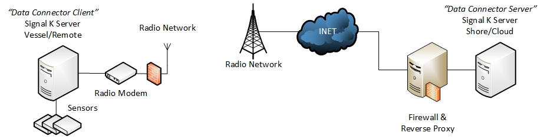

# Signal K Edge Link

Signal K Edge Link is a Signal K plugin that transfers vessel deltas between Signal K servers over encrypted UDP.

It is designed for links where latency, packet loss, and bandwidth usage matter (cellular, satellite, and other unstable WAN paths).



## Why use it?

- **Secure transport** using AES-256-GCM
- **Bandwidth optimization** with Brotli compression (plus optional MessagePack and path dictionary)
- **Two operating modes**:
  - **Client**: subscribes to local deltas and sends packets
  - **Server**: receives packets, decrypts, and forwards to local Signal K
- **Protocol v2 features** for difficult links:
  - ACK/NAK-based reliability
  - congestion control
  - optional primary/backup bonding
  - monitoring and alerting endpoints
- **Multi-connection support** on one Signal K instance

## How data flows

```text
Client Signal K
  -> subscribe + batch deltas
  -> optional path dictionary + MessagePack
  -> Brotli compress
  -> AES-256-GCM encrypt
  -> UDP send

Server Signal K
  <- UDP receive
  <- AES-256-GCM decrypt
  <- Brotli decompress
  <- optional MessagePack + path decode
  <- inject into local Signal K
```

## Requirements

- Two Signal K instances (source and destination)
- UDP reachability from client to server on your chosen port
- Shared encryption key on both ends (32-character ASCII, 64-character hex, or 44-character base64)
- Node.js 16+ (if installing from source)

## Installation

### Option A: Signal K Plugin Manager

Install **Signal K Edge Link** from your Signal K plugin catalog.

### Option B: Manual install from source

```bash
cd ~/.signalk/node_modules
git clone https://github.com/KEGustafsson/signalk-edge-link.git
cd signalk-edge-link
npm install
npm run build
```

Restart Signal K after installation.

## Quick start

### 1) Configure the destination (Server mode)

In Signal K Admin UI:

1. Open `Server -> Plugin Config -> Signal K Edge Link`
2. Click **Add Server**
3. Set:
   - `Connection Name` (for example `shore-server`)
   - `UDP Port` (default `4446`)
   - `Encryption Key` (same shared secret used by client)
   - `Protocol Version` (`2` recommended)
4. Save

### 2) Configure the source (Client mode)

On the sending Signal K instance:

1. Open `Server -> Plugin Config -> Signal K Edge Link`
2. Click **Add Client**
3. Set:
   - `Connection Name` (for example `vessel-client`)
   - `Server Address` (destination host/IP)
   - `UDP Port` (must match server)
   - `Encryption Key` (must match server)
   - `Protocol Version` (`2` recommended)
4. Save

### 3) Verify traffic

Open the runtime UI:

`http://<signalk-host>:3000/plugins/signalk-edge-link/`

Check that:

- client `Deltas Sent` increases
- server `Deltas Received` increases
- encryption/decryption errors remain stable at zero

## Protocol version guidance

| Version | Use when | Notes |
|---|---|---|
| v1 | stable local links, simplest setup | lower overhead, no ACK/NAK reliability layer |
| v2 | packet loss, variable latency, WAN links | adds retransmission, congestion control, bonding, richer monitoring |

For unstable links, start with **v2 defaults** and tune only after checking metrics.

## Runtime UI and API

- Runtime UI: `/plugins/signalk-edge-link/`
- API base path: `/plugins/signalk-edge-link`
- Default API rate limit: **120 requests/minute/IP**

Most used endpoints:

- `GET /metrics`
- `GET /network-metrics`
- `GET /monitoring/alerts`
- `GET /connections`
- `GET /instances`
- `GET /instances/:id`
- `GET /connections/:id/metrics`
- `GET /connections/:id/network-metrics`
- `GET /bonding`
- `POST /bonding`

For full endpoint details, use `docs/api-reference.md`.

## Configuration model (summary)

Configuration is an array of independent connections:

```json
{
  "connections": [
    {
      "name": "shore-server",
      "serverType": "server",
      "udpPort": 4446,
      "secretKey": "<32-byte key>",
      "protocolVersion": 2
    },
    {
      "name": "sat-client",
      "serverType": "client",
      "udpPort": 4447,
      "udpAddress": "10.0.0.1",
      "secretKey": "<32-byte key>",
      "protocolVersion": 2
    }
  ]
}
```

- Each connection runs independently.
- Legacy single-object config is auto-normalized to one connection.
- Client runtime JSON files (`delta_timer.json`, `subscription.json`, `sentence_filter.json`) are stored per connection and can be edited via API.

For complete setting definitions and ranges, use `docs/configuration-reference.md`.

Schema and migration helpers:

- `schemas/config.schema.json` (machine-readable config schema)
- `scripts/migrate-config.js` (convert legacy flat config to `connections[]`)
- `npm run migrate:config -- <input.json> [output.json]`

## Security notes

- Uses AES-256-GCM authenticated encryption.
- Keys must match exactly and can be entered as 32-character ASCII, 64-character hex, or 44-character base64.
- Restrict UDP ingress to trusted source addresses whenever possible.

Example key generation:

```bash
openssl rand -hex 32
```

## Troubleshooting

Common checks:

- Verify `udpAddress`, `udpPort`, and `secretKey` match both ends.
- Confirm server UDP port is reachable and not already in use.
- If link quality is poor, switch to `protocolVersion: 2` and monitor retransmissions/RTT before tuning.

For issue-oriented diagnostics, use `docs/troubleshooting.md`.

## Developer commands

```bash
npm run build
npm run dev
npm test
npm run test:v2
npm run test:integration
npm run lint
npm run lint:fix
npm run cli -- help
npm run cli -- instances list --token=$EDGE_LINK_TOKEN --state=running --limit=10 --page=1 --format=table
npm run cli -- instances show alpha --token=$EDGE_LINK_TOKEN --format=table
npm run cli -- instances create --config ./new-instance.json --token=$EDGE_LINK_TOKEN
npm run cli -- instances update alpha --patch '{"udpAddress":"10.0.0.2"}' --token=$EDGE_LINK_TOKEN
npm run cli -- instances delete alpha --token=$EDGE_LINK_TOKEN
npm run cli -- bonding status --token=$EDGE_LINK_TOKEN --format=table
npm run cli -- bonding update --patch '{"failoverThreshold":300}' --token=$EDGE_LINK_TOKEN
npm run cli -- status --token=$EDGE_LINK_TOKEN --format=table
```

Management API security: set `managementApiToken` in plugin options (or environment variable `SIGNALK_EDGE_LINK_MANAGEMENT_TOKEN`) and send it as `X-Edge-Link-Token` or `Authorization: Bearer <token>` for management/configuration/control routes such as `/instances`, `/bonding`, `/status`, `/plugin-config`, `/config/*`, `/connections/:id/config/*`, `/monitoring/alerts`, `/capture/*`, and `/delta-timer`. CLI commands support this via `--token=<token>` or `SIGNALK_EDGE_LINK_MANAGEMENT_TOKEN`.

## Documentation map

- `docs/README.md` (documentation index)
- `docs/architecture-overview.md` (system architecture and lifecycle)
- `docs/configuration-reference.md` (settings and defaults)
- `docs/api-reference.md` (REST endpoints)
- `docs/protocol-v2.md` (v2 protocol operational overview)
- `docs/bonding.md` (bonding concepts and API usage)
- `docs/congestion-control.md` (congestion-control behavior and tuning)
- `docs/metrics.md` (metrics and monitoring reference)
- `docs/management-tools.md` (instance/bonding API + CLI operations)
- `docs/security.md` (security guidance and deployment hardening)
- `docs/performance-tuning.md` (deployment tuning recommendations by hardware profile)
- `samples/` (example JSON configurations for minimal/dev/v2-bonding setups)
- `grafana/dashboards/edge-link.json` (starter Grafana dashboard)
- `schemas/config.schema.json` (unified plugin config schema)
- `scripts/migrate-config.js` (legacy config migration utility)
- `bin/edge-link-cli.js` (CLI wrapper for migration and instance/bonding management)


## License

MIT. See `LICENSE`.
