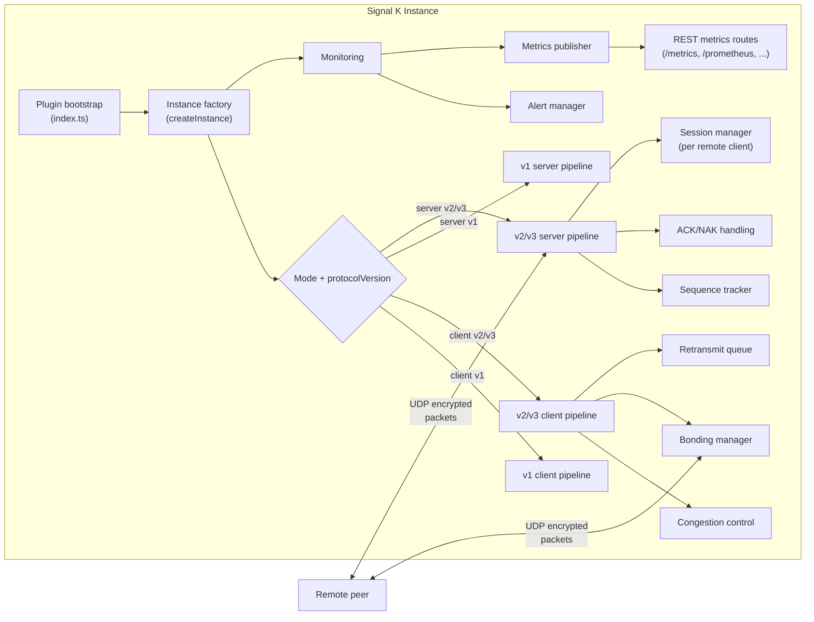

# Architecture overview

This document describes how Signal K Edge Link components are structured and interact at runtime.

## Component map



## Data encoding pipeline

Every outbound delta batch passes through these stages in order (client side):

```
Signal K delta objects
  → [optional] MessagePack binary encoding    (useMsgpack: true)
  → [optional] path dictionary compression    (usePathDictionary: true)
  → Brotli compression                        (always on, quality 6)
  → AES-256-GCM encryption + IV generation    (always on)
  → [v2/v3] packet header prepend             (sequence number, type, CRC)
  → UDP send
```

The server-side pipeline is the reverse:

```
UDP receive
  → [v2/v3] header parse + CRC verify
  → AES-256-GCM decrypt + auth tag verify
  → Brotli decompress
  → [optional] path dictionary decode
  → [optional] MessagePack decode
  → app.handleMessage() → Signal K bus
```

If any stage fails, the packet is dropped and the relevant error counter increments.

## Instance lifecycle

1. **Startup:** `index.ts` reads and normalizes the stored configuration (legacy flat objects are promoted to `connections[]`).
2. **Instance creation:** One `EdgeLinkInstance` is created per configured connection. Each instance gets its own UDP socket, metrics state, and monitoring context.
3. **Protocol selection:** The instance factory inspects `serverType` and `protocolVersion` to select the correct pipeline module (v1, v2-client, or v2-server). Protocol v3 reuses the v2 pipelines with authenticated control packet verification.
4. **Subscription (client):** Client instances register a Signal K delta subscription using the paths defined in `subscription.json`. New deltas are buffered until the `deltaTimer` fires or the smart batching size limit is reached.
5. **Hot-reload:** Runtime JSON config files (`delta_timer.json`, `subscription.json`, `sentence_filter.json`) are watched via `fs.watch`. Changes take effect immediately without a plugin restart.
6. **REST routes:** All API endpoints are registered under `/plugins/signalk-edge-link/`. Management endpoints require an optional `managementApiToken` when configured.
7. **Stop:** On `plugin.stop()`, all sockets, timers, file watchers, and monitoring intervals are cleaned up per instance.

## Protocol v1 vs v2/v3

| Aspect                 | v1                      | v2/v3                                           |
| ---------------------- | ----------------------- | ----------------------------------------------- |
| Packet format          | `[IV][Ciphertext][Tag]` | `[15-byte header][IV][Ciphertext][Tag]`         |
| Sequence tracking      | None                    | 32-bit sequence numbers, gap detection          |
| Reliability            | Best-effort UDP         | ACK/NAK retransmission, retransmit queue        |
| Congestion control     | Manual timer only       | AIMD algorithm, auto adjustment                 |
| Bonding                | None                    | Primary/backup failover with hysteresis         |
| Control authentication | None                    | v3: HMAC-signed ACK/NAK/HEARTBEAT/HELLO         |
| Monitoring telemetry   | Basic bandwidth         | 30+ metrics, Prometheus, packet capture, alerts |

v3 is the same as v2 with the addition of authenticated control packets — it does not change the data packet format.

## Key source files

| File / directory                 | Purpose                                                                    |
| -------------------------------- | -------------------------------------------------------------------------- |
| `src/index.ts`                   | Plugin entry point; normalizes config, creates instances, registers routes |
| `src/pipeline.ts`                | v1 client and server pipelines                                             |
| `src/pipeline-v2-client.ts`      | v2/v3 client pipeline: send, ACK tracking, retransmit                      |
| `src/pipeline-v2-server.ts`      | v2/v3 server pipeline: receive, ACK/NAK dispatch, session tracking         |
| `src/crypto.ts`                  | AES-256-GCM encrypt/decrypt wrappers                                       |
| `src/packet.ts`                  | v2 packet header encode/decode, CRC                                        |
| `src/retransmit-queue.ts`        | Bounded retransmit queue with timeout-based eviction                       |
| `src/sequence.ts`                | Sequence tracking, gap detection, and NAK timer scheduling                 |
| `src/bonding.ts`                 | Primary/backup health checks and failover logic                            |
| `src/congestion.ts`              | AIMD controller; adjusts delta timer based on RTT/loss                     |
| `src/monitoring.ts`              | Packet loss heatmap, retransmit chart, path latency, and alert thresholds  |
| `src/routes/`                    | Express route handlers for all REST API endpoints                          |
| `src/webapp/`                    | React-based management UI (compiled to `public/`)                          |
| `src/scripts/migrate-config.ts`  | CLI script to convert legacy flat config to `connections[]`                |
| `src/bin/edge-link-cli.ts`       | CLI wrapper for instance and bonding management operations                 |
| `src/index.ts` (`plugin.schema`) | Runtime RJSF schema served to the Signal K admin UI                        |

## Configuration areas

Each connection's configuration is grouped into:

- **Identity/role:** `name`, `serverType`
- **Transport:** `udpAddress`, `udpPort`, `secretKey`
- **Protocol:** `protocolVersion`, `useMsgpack`, `usePathDictionary`
- **Adaptive behavior:** `congestionControl`, `bonding`
- **Observability:** `alertThresholds`, `helloMessageSender`, `pingIntervalTime`
- **Runtime files (hot-reload):** `delta_timer.json`, `subscription.json`, `sentence_filter.json`

For full definitions and defaults, see `docs/configuration-reference.md`.

## Future planning

Future protocol-version migration constraints are tracked in docs/future-security-and-protocol-roadmap.md.
