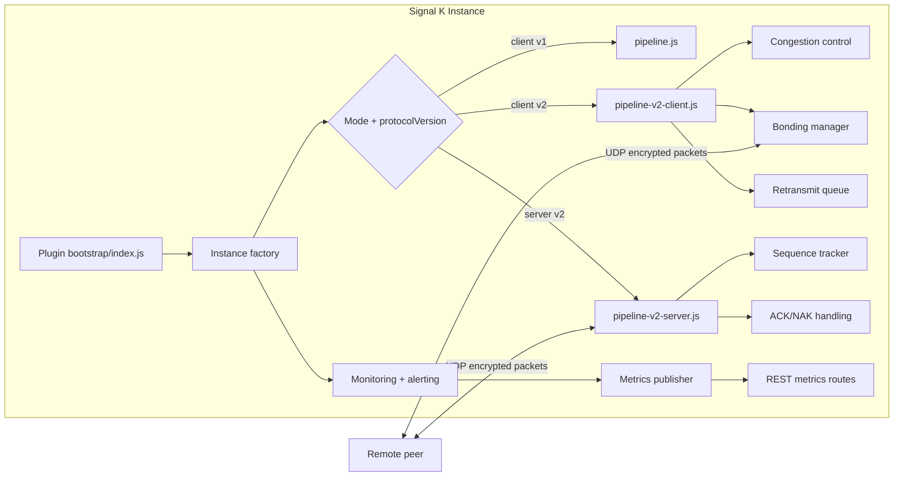

# Architecture overview

This document provides a high-level view of how Signal K Edge Link components interact at runtime.

## Component map

## Instance lifecycle

1. Plugin start normalizes configured connections and creates one runtime instance per connection.
2. Each instance initializes metrics, monitoring, and protocol pipeline based on role (client/server) and protocol version.
3. Client instances subscribe to local deltas, batch data, encode/compress/encrypt and send over UDP.
4. Server instances receive UDP packets, verify/decrypt/decompress, decode deltas, and pass updates to Signal K via `app.handleMessage()`.
5. Runtime routes expose health/metrics/config and control endpoints (`/metrics`, `/network-metrics`, `/instances`, `/bonding`, etc.).
6. On stop, sockets/timers/watchers are cleaned up per instance.

## Protocol v1 vs v2

- **v1**: streamlined sender/receiver path with encryption/compression, suitable for stable links.
- **v2**: adds packet headers, sequencing, ACK/NAK reliability, retransmission support, optional bonding, congestion adaptation, and richer monitoring telemetry.

## Bonding behavior (v2 client)

Bonding maintains primary and backup links in main-backup mode:

- Health checks track RTT and packet loss.
- Failover occurs when active link quality crosses configured thresholds.
- Failback requires hysteresis and delay to avoid oscillation.
- Active link and link health are exported in API metrics.

## Configuration areas

Current top-level configuration for each connection includes:

- identity/role: `name`, `serverType`
- transport: `udpAddress`, `udpPort`, `secretKey`
- protocol: `protocolVersion`
- optional controls: `congestionControl`, `bonding`, `alertThresholds`

For full definitions and defaults, see `docs/configuration-reference.md`.
